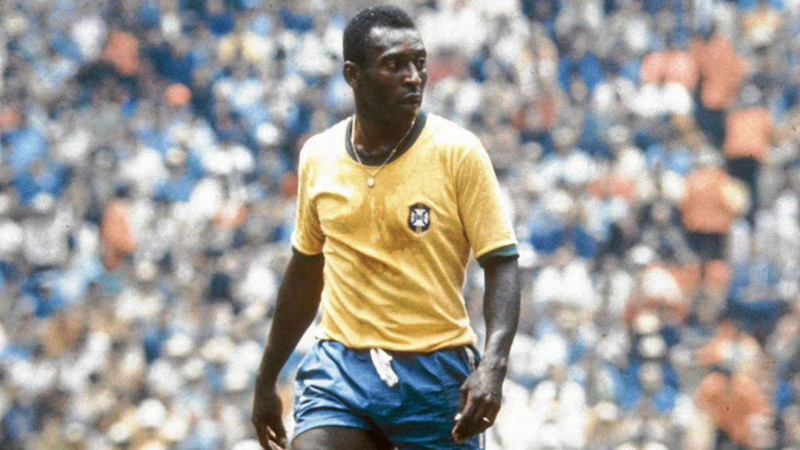
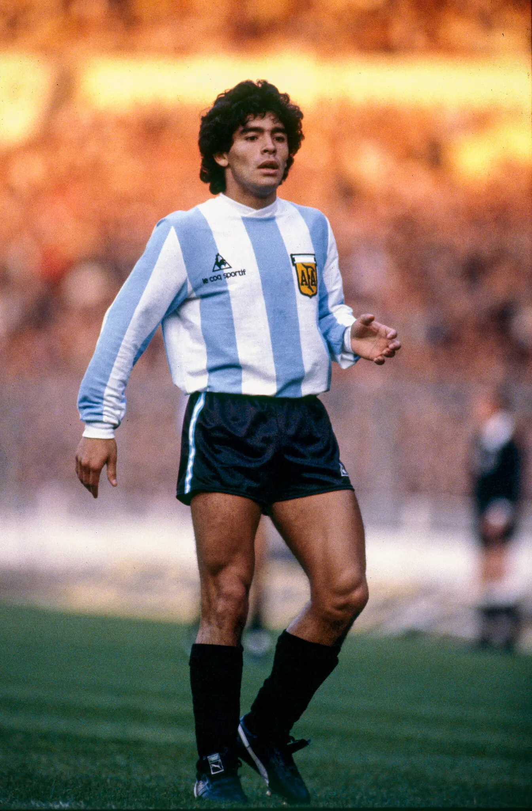

# El meu document Markdown

**Aquí tienes una lista de los 4 mejores jugadores de futbol:**

1- ***Cristiano Ronaldo***


2- ***Messi***


3- ***Pele***




4- ***Maradona***




També podeu afegir [enllaços](https://www.transfermarkt.es/cristiano-ronaldo/profil/spieler/8198)

Podeu ressaltar el text en *cursiva* o **negreta** segons les vostres necessitats.

3. [inicio]()
   
```javascript
// Aquest és un bloc de codi
exemple de funció () {
     // Exemple de codi
}
